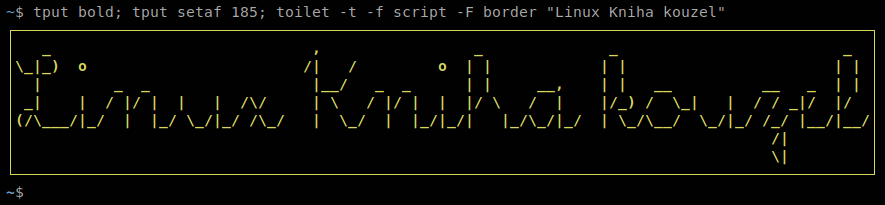

<!--

Linux Kniha kouzel, README
Copyright (c) 2019, 2020 Singularis <singularis@volny.cz>

Toto dílo je dílem svobodné kultury; můžete ho šířit a modifikovat pod
podmínkami licence Creative Commons Attribution-ShareAlike 4.0 International
vydané neziskovou organizací Creative Commons. Text licence je přiložený
k tomuto projektu nebo ho můžete najít na webové adrese:

https://creativecommons.org/licenses/by-sa/4.0/

-->

„Linux: Kniha kouzel“ je open source sbírka velmi krátkých řešených příkladů pro příkazovou řádku/příkazový řádek systému Linux, především distribuce Ubuntu. V současnosti je dostupná ve formátu HTML pro zobrazení na počítači a ve formátu PDF pro tisk na papír.

Verze *vanilková příchuť 1.10 Františka Fučíková*, je cílena na *Ubuntu 18.04 Bionic Beaver* a jeho deriváty.

Příručka podléhá licenci [CC BY-SA 4.0](https://creativecommons.org/licenses/by-sa/4.0/).
Podrobné údaje o autorství zdrojových souborů jsou uvedeny v komentářích v jejich záhlaví;
údaje o autorství obrázkových souborů jsou uvedeny v souboru [COPYRIGHT](COPYRIGHT).

## Návod k použití

### Použití online (pro začátečníky)

Navštivte [webové stránky](https://singularis-mzf.github.io/) a vyberte si nejnovější verzi pro váš operační systém. Na přehledové stránce si pak zvolíte jednu či více kapitol, které si chcete prohlédnout (zvolíte-li si více kapitol, doporučuji je otevít v samostatných „panelech“ prohlížeče). Ve vybraných kapitolách pak najděte nějaké zaklínadlo, které si chcete vyzkoušet. Obvyklý postup jeho použití je následující:

1. Zamyslete se, jaký kontext zaklínadlo vyžaduje. (Nemá smysl se např. snažit vypsat název větve gitu mimo jeho pracovní adresář. Ne všechna zaklínadla se zapisují přímo na příkazovou řádku.)
2. Označte zaklínadlo v prohlížeči (má-li zaklínadlo víc alternativních variant, označte jen jednu z nich).
3. Zkopírujte ho do schránky (Ctrl+C).
4. Přepněte se do okna terminálu (nebo otevřete nové).
5. Vložte zaklínadlo (Shift+Ctrl+V).
6. Projděte zaklínadlo a místa, která jsou na webové stránce označena podtržením (k doplnění), doplňte odpovídajícími parametry.
7. Potvrďte příkaz (Enter).

*Poznámka:* Linux: Kniha kouzel není tutorial. Pokud na první pokus nepochopíte, jak se uvedená zaklínadla používají, zkuste si prohlédnout ukázku (sekce „Ukázka“), pokud ji daná kapitola nabízí. Pokud to nepomůže, musíte nejprve navštívit jiné stránky, kde vám použití daných nástrojů někdo názorně vysvětlí. Odkazy na takové stránky (včetně videí) najdete v sekci „Další zdroje informací“ prakticky v každé kapitole.

### Použití online (pro pokročilé)

Navštivte [webové stránky](https://singularis-mzf.github.io/), vyberte požadovanou verzi knihy, zvolte kapitoly, které jsou blízké tématu, které vás zajímá, a projděte přehled zaklínadel, který kapitola nabízí. Zaklínadla můžete ze stránky přímo vykopírovat, jen bude potřeba doplnit parametry označené podtržením.

### Použití offline

Na stránce [releases](https://github.com/singularis-mzf/linux-spellbook/releases) tohoto repozitáře si můžete stáhnout offline HTML variantu libovolné vydané verze projektu. Offline HTML verze funguje opravdu offline; internet budete potřebovat, jedině pokud se budete chtít podívat na některý z odkazovaných webů.

Pro tisk jsou určeny varianty ve formátu PDF, které jsou rovněž ke stažení na stránce [releases](https://github.com/singularis-mzf/linux-spellbook/releases). Tištěná verze je podstatně přehlednější než jakákoliv elektronická. Doporučuji vytištěné listy svázat do kroužkové vazby.

## Návod k sestavení

Následující postup popisuje takzvané „malé sestavení“, kdy vzniknou jen formáty HTML a LOG.
Úplné sestavení je popsáno v souboru [PREKLAD.md](PREKLAD.md).

Budete potřebovat:

* Git
* GNU make
* GNU awk
* ImageMagick
* qrencode
* kvůli řazení české locale „cs\_CZ.UTF-8“ (musí fungovat české řazení příkazem „sort“)

Ověřil/a jsem, že v Ubuntu 18.04 LTS a Linuxu Mint 17.3 můžete tyto nástroje nainstalovat příkazem:

> ``sudo apt-get install git make gawk imagemagick qrencode``

Až budete mít nainstalované potřebné nástroje, stáhněte si repozitář:

> ``git clone https://github.com/singularis-mzf/linux-spellbook.git``

A nakonec spusťte make:

> ``cd linux-spellbook`` 
> ``make -j4 log html``

Předpokládám použití **české lokalizace** daného systému.

## Návod k zapojení se

Viz soubor [JAK-SE-ZAPOJIT.md](JAK-SE-ZAPOJIT.md).

### Výběr a pořadí kapitol

Chcete-li si sám/a vybrat, které kapitoly se sestaví do výstupního adresáře, zkopírujte soubor
[poradi-kapitol.vychozi.lst](poradi-kapitol.vychozi.lst) na „poradi-kapitol.lst“ a upravte.
Píše se jedno id kapitoly či dodatku na řádek (id je název souboru bez adresářové cesty a bez přípony)
a kapitoly ani dodatky se nesmějí opakovat.

## Stav vývoje kapitol (podle ID)

| ID | Název kapitoly | Růst | Stav |
| :--- | :--- | ---: | :--- |
| [awk](kapitoly/awk.md) | AWK | 100% | vydána (od verze 1.2) |
| [barvy-a-titulek](kapitoly/barvy-a-titulek.md) | Barvy, titulek a výzva terminálu | 100% | vydána (od verze 1.0) |
| [datum-cas-kalendar](kapitoly/datum-cas-kalendar.md) | Datum, čas a kalendář | 100% | vydána (od verze 1.1) |
| [diskove-oddily](kapitoly/diskove-oddily.md) | Diskové oddíly | 100% | vydána (od verze 1.6) |
| [docker](kapitoly/docker.md) | Docker | 100% | vydána (od verze 1.0) |
| [git](kapitoly/git.md) | Git | 100% | vydána (od verze 1.0) |
| [hledani-souboru](kapitoly/hledani-souboru.md) | Hledání souborů | 100% | vydána (od verze 1.5) |
| [make](kapitoly/make.md) | Make | 100% | vydána (od verze 1.0) |
| [markdown](kapitoly/markdown.md) | Markdown | 100% | vydána (od verze 1.0) |
| [planovani-uloh](kapitoly/planovani-uloh.md) | Plánování úloh | 100% | vydána (od verze 1.0) |
| [prace-s-archivy](kapitoly/prace-s-archivy.md) | Práce s archivy | 100% | vydána (od verze 1.1) |
| [promenne](kapitoly/promenne.md) | Proměnné prostředí a interpretu | 100% | vydána (od verze 1.9) |
| [regularni-vyrazy](kapitoly/regularni-vyrazy.md) | Regulární výrazy | 100% | vydána (od verze 1.1) |
| [sed](kapitoly/sed.md) | Sed | 100% | vydána (od verze 1.8) |
| [soubory-a-adresare](kapitoly/soubory-a-adresare.md) | Soubory a adresáře | 100% | vydána (od verze 1.5) |
| [sprava-balicku](kapitoly/sprava-balicku.md) | Správa balíčků | 100% | vydána (od verze 1.1) |
| [sprava-procesu](kapitoly/sprava-procesu) | Správa procesů | 100% | vydána (od verze 1.4) |
| [stahovani-videi](kapitoly/stahovani-videi.md) | Stahování videí | 100% | vydána (od verze 1.0) |
| [system](kapitoly/system.md) | Systém | 100% | vydána (od verze 1.2) |
| [vim](kapitoly/vim.md) | Vim | 100% | vydána (od verze 1.8) |
| [zpracovani-textovych-souboru](kapitoly/zpracovani-textovych-souboru.md) | Zpracování textových souborů | 100% | vydána (od verze 1.2) |
| [zpracovani-videa-a-zvuku](kapitoly/zpracovani-videa-a-zvuku.md) | Zpracování videa a zvuku | 100% | vydána (od verze 1.0) |
| [sprava-uzivatelskych-uctu](kapitoly/sprava-uzivatelskych-uctu.md) | Správa uživatelských účtů | 100% | připravena k vydání |
| [x](kapitoly/x.md) | X (Správce oken) | 60% | dítě |
| [zpracovani-obrazku](kapitoly/zpracovani-obrazku.md) | Zpracování obrázků | 40% | dítě |
| [odkazy](kapitoly/odkazy.md) | Pevné a symbolické odkazy | 20% | dítě |
| [perl](kapitoly/perl.md) | Základy Perlu | 20% | dítě |
| [zpracovani-binarnich-souboru](kapitoly/zpracovani-binarnich-souboru.md) | Zpracování binárních souborů | 20% | dítě |
| [moderni-veci](kapitoly/moderni-veci.md) | Moderní věci | 10% | dítě |
| [unicode](kapitoly/unicode.md) | Unicode a emotikony | 10% | dítě |
| [uzivatelska-rozhrani](kapitoly/uzivatelska-rozhrani.md) | Uživatelská rozhraní skriptů | 5% | dítě |
| [apache](kapitoly/apache.md) | Webový server Apache | 5% | dítě |
| [latex](kapitoly/latex.md) | LaTeX | 5% | dítě |
| [dosbox](kapitoly/dosbox.md) | DosBox | 5% | dítě |
| [bash](kapitoly/bash.md) | Bash | 2% | dítě |
| [lkk](kapitoly/lkk.md) | Linux: Kniha kouzel | 2% | dítě |
| [sprava-balicku-2](kapitoly/sprava-balicku-2) | Správa balíčků 2 | 1% | dítě |
| [firefox](kapitoly/firefox.md) | Firefox | 1% | dítě |
| [grub](kapitoly/grub.md) | GRUB a jádro | 1% | dítě |
| [konverze-formatu](kapitoly/konverze-formatu.md) | Konverze formátů | 0% | embryo |
| [wine](kapitoly/wine.md) | Wine | 0% | embryo |
| [pdf](kapitoly/pdf.md) | PDF | 0% | embryo |
| [virtualbox](kapitoly/virtualbox.md) | VirtualBox | 0% | embryo |
| [stahovani-web](kapitoly/stahovani-web.md) | Stahování webových stránek | 0% | embryo |
| prehravani-videa | Přehrávání videa, zvuku a obrázků | - | přál/a bych si |
| sifrovani | Šifrování a kryptografie | - | přál/a bych si |
| firewall | Firewall | - | přál/a bych si |
| sql | SQL | - | přál/a bych si |
| ascii-art | ASCII art | - | přál/a bych si |
| matematicke-vypocty | Matematické výpočty | - | přál/a bych si |
| zaznam-x | Záznam obrazovky | - | přál/a bych si |
| css | Kaskádové styly CSS | - | přál/a bych si |
| nabidka-aplikaci | Nabídka aplikací | - | přál/a bych si |

Zvláštní kapitoly:

* [_ostatni](kapitoly/_ostatni.md) − Slouží k dočasnému shromážďování dosud nezařazených zaklínadel.
* [_sablona](kapitoly/_sablona.md) − Nepřekládá se. Slouží jako výchozí podoba pro nově založené kapitoly.
* [_ukazka](kapitoly/_ukazka.md) − Překládá se, ale není součástí vydaných verzí. Slouží k dokumentaci a testování mechanismu překladu. Obsahuje všechny podporované jazykové konstrukce a znaky.

## Podobné projekty

*Poznámka: Uvedené údaje o licencích jsou orientační, a ačkoliv je uvádím v dobré víře, nemusí již být aktuální!*

* [Sallyx.org](https://www.sallyx.org/) (nesvobodná licence CC BY-NC-SA 3.0) jsou vynikající, obsáhlé a dodnes velmi dobře udržované stránky o Linuxu a programování. Na rozdíl od *Linuxu: Knihy kouzel* nejsou open-source (autor je udržuje sám, v podstatě jde o freeware) a nemají knižní ambice, jsou však optimalizovány pro samouky, aby se z nich uváděné nástroje mohli snadno naučit. Dle mého názoru jde o nejlepší konkurenční zdroj v češtině.
* [Pure Bash Bible](https://github.com/dylanaraps/pure-bash-bible) (anglicky, licence: MIT) je stejně jako *Linux: Kniha kouzel* knihou řešených příkladů (ačkoliv jde o e-book) a také se snaží nabízet ověřená a co nejlepší řešení, autor dokonce na svoje příkazy píše automatizované testy. Oproti Linuxu: Knize kouzel je ale Pure Bash Bible zaměřená pouze na příkazový interpret „bash“.
* [Linux Journey](https://linuxjourney.com/) (anglicky, licence pouze textu: CC BY-SA 4.0) je rozsáhlý a kvalitní výukový kurz linuxových příkazů z různých oblastí. Hlavním rozdílem oproti Linuxu: Knize kouzel zde je, že je zaměřený na výuku (dokonce u jednotlivých sekcí nabízí i úkoly k procvičení), není však tak podrobný a vyhýbá se komplikovaným a nejmodernějším technologiím (např. tam nenajdete vysvětlení ACL, LVM apod.).
* [TL;DR](https://github.com/tldr-pages/tldr) (anglicky − „Too Long; Didn't Read“, licence: MIT) představuje výrazně zjednodušené manuálové stránky s krátkými příklady k jednotlivým nástrojům. Na rozdíl od *Linuxu: Knihy kouzel* je organizován po nástrojích, takže musíte vědět, k čemu chcete nápovědu, a neporadí vám lepší nástroje k provedení dané činnosti. Ke každému nástrojí navíc uvádí jen nejběžnější příklady. Kladem je, že jeden z jeho klientů je dostupný jako balíček [Ubuntu](https://packages.ubuntu.com/bionic/tldr) a [Debianu](https://packages.debian.org/buster/tldr).
* Projekt [eg](https://github.com/srsudar/eg) (anglicky, licence MIT) nabízí zjednodušené a velmi praktické „manuálové stránky“ s vynikajícím zvýrazňováním syntaxe, snadným přístupem a možností je snadno upravovat (v Markdownu). Jeho nedostatkem je orientace na dokumentaci nástrojů spíš než na řešení úloh. Také již není příliš aktivně vyvíjen (poslední verze 1.1.1 je z října 2018). (Mimochodem, autor má smysl pro humor, když radí přejmenovat „eg“ na „woman“.)
* [Cheat](https://github.com/chrisallenlane/cheat) (anglicky, licence: MIT) je nástroj pro správu vlastních jednoduchých „manuálových stránek“. Používá se snadno, ale není určen k objevování nových programů a ve srovnání s klasickými manuálovými stránkami má horší zvýrazňování syntaxe.
* [Bro Pages](http://bropages.org) (anglicky, pozor − proprietární licence) nabízejí stejně jako *Linux: Kniha kouzel* obsáhlejší přehled možností, ale stále organizovaný po jednotlivých nástrojích a bez kategorizace do logických skupin.

### Zastaralé podobné projekty

* [The Linux Documentation Project](http://www.tldp.org/) (anglicky, licence: GFDL 1.2, některé části i pod jinými svobodnými licencemi) je monumentální historická sbírka návodů a příruček mapující Linux. Je již ovšem prakticky neudržovaná a většinou velmi zastaralá. K návštěvě ji mohu doporučit jen „počítačovým archeologům“, rozhodně ne současným začátečníkům.
* [GNU/Linux Desktop Survival Guide](https://togaware.com/linux/survivor/) (anglicky, licence: GPL v2+ nebo CC BY 2.0+) je původně rozsáhlá sbírka jednostránkových článků o konkrétních problémech uživatele GNU/Linuxu. Ačkoliv je dodnes udržovaná, připadá mi, že jedinou formou aktualizace je odstraňování již neaktuálního obsahu, po kterém bohužel zůstávají prázdné články. Na rozdíl od Linuxu: Knihy kouzel již vyšel knižně a PDF verze je placená (HTML verze je dostupná online a zdarma).

## Licence

Kniha a všechny zdrojové kódy podléhají licenci [CC BY-SA 4.0](https://creativecommons.org/licenses/by-sa/4.0/),
některé soubory nabízejí také jinou licenci.
Podrobné údaje o autorství a konkrétní licenci zdrojových souborů jsou uvedeny v komentářích
v jejich záhlaví; údaje o autorství obrázkových a datových souborů (včetně formátu .tsv)
jsou uvedeny v souboru [COPYRIGHT](COPYRIGHT).
