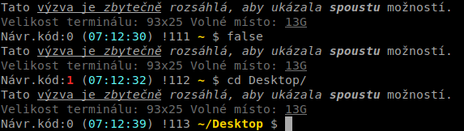

<!--

Linux Kniha kouzel, kapitola Barvy, titulek a výzva terminálu
Copyright (c) 2019, 2020 Singularis <singularis@volny.cz>

Toto dílo je dílem svobodné kultury; můžete ho šířit a modifikovat pod
podmínkami licence Creative Commons Attribution-ShareAlike 4.0 International
vydané neziskovou organizací Creative Commons. Text licence je přiložený
k tomuto projektu nebo ho můžete najít na webové adrese:

https://creativecommons.org/licenses/by-sa/4.0/

-->
<!--
ÚKOLY:

Poznámky:

Zobrazit větev gitu - složité řešení:
$(git branch 2>/dev/null | gawk "/^\\* /{print \" (git:\" substr(\$0,3) \")\";}")
Jednoduché řešení:
__git_ps1

-->

# Barvy, titulek a výzva terminálu

!Štítky: {tematický okruh}{bash}{barvy}
!FixaceIkon: 1754
!ÚzkýRežim: ZAP

## Úvod

Tato kapitola pokrývá ovládání barvy písma, barvy pozadí, použitého fontu, titulku terminálového okna a pozice a vlastností kurzoru. Rovněž pokrývá nastavování výzev interpretu bash (PS1 a dalších). Logicky by patřila do kapitoly o příkazovém interpretu bash, ale ta bude velmi rozsáhlá a náročná na zpracování, proto jsem toto téma vydělil/a do samostatné kapitoly.

Barvy a font se v příkazové řádce Linuxu nastavují pomocí takzvaných escape sekvencí, což jsou zvláštní řídicí sekvence bajtů, kterým daný terminál rozumí a místo jejich vypsání na obrazovku změní písmo, přesune kurzor nebo udělá jinou akci, která je v dané sekvenci zakódována. Abychom se tyto sekvence nemuseli učit, používáme místo nich moderní příkaz „tput“, který načte příslušnou sekvenci ze své databáze a vypíše ji na svůj standardní výstup. Pokud tento výstup směřuje přímo na terminál, požadovaná akce se ihned provede; častěji se ale sekvence ukládá do proměnné k pozdějšímu použití; k její aktivaci pak stačí danou proměnnou vypsat na terminál příkazem jako „printf“ či „echo“.

Tato verze kapitoly nepokrývá zvláštní schopnosti konkrétních terminálových programů (např. rozdíly mezi Terminatorem a Konsolí) a podporu šestnácti milionů barev, která zatím v terminálových programech není dostatečně rozšířena (ačkoliv některé už příslušné escape sekvence podporují).

Jedna z prvních věcí, která mě po otevření linuxového terminálu naštvala, bylo to, že neustále barevně zdůrazňoval moje uživatelské jméno a uváděl ho do titulku snad každého terminálového okna. Když si v Xubuntu ve výchozím nastavení poprvé otevřete Terminator a rozdělíte ho na čtyři podokna, svoje uživatelské jméno uvidíte na *deseti* místech a zopakuje se pokaždé, když máte zadat další příkaz. Mám z toho pocit, že toto nastavení musel navrhovat někdo s narcistickou poruchou osobnosti... Pokud si to chcete předělat, tato kapitola vám poradí jak.

## Definice

* **Výzva terminálu** (zkráceně „výzva“) je řetězec, který interpret příkazové řádky vypisuje před, během nebo po přijetí příkazu od uživatele (tzn. v interaktivním režimu). V interpretu „bash“ se rozeznávají tři druhy výzvy a jejich šablony jsou uloženy v proměnných PS0, PS1 a PS2: **hlavní výzva** (PS1) značí, že bash očekává příkaz, **vedlejší výzva** (PS2) značí, že bash očekává pokračování příkazu na dalším řádku, **potvrzující výzva** (PS0) se vypisuje po přijetí příkazu a před zahájením jeho vykonávání.
* **Escape sekvence** je posloupnost bajtů, na kterou terminál zareaguje změnou nastavení (např. barvy písma) či nějakou akcí. Escape sekvence začínají netisknutelným znakem „escape“ (ASCII kód 0x1b). V minulosti se zapisovaly ručně a děsily nezkušené uživatele; dnes je však můžeme pohodlně generovat moderním příkazem „tput“, který současně redukuje problémy s kompatibilitou jednotlivých typů terminálů.
* **Paleta** je v této kapitole pole barev, které daný terminál podporuje, *indexované od nuly*. Typicky se vyskytují pouze dvě palety: s 8 barvami a s 256 barvami, ačkoliv realizace konkrétních barev v těchto paletách se mohou v jednotlivých terminálech mírně lišit.

!ÚzkýRežim: VYP

## Zaklínadla

### Titulek
*# nastavit **titulek** okna terminálu* 
*// Ve výchozím nastavení nastavuje titulek terminálu jeho hlavní výzva PS1. Proto ji musíte před experimentováním vypnout, např. příkazem „PS=""“, jinak vám vaše nové nastavení hned přepíše a ani si toho nevšimnete.* 
**printf %s\\\\n "$TERM" \| egrep -isq "^(xterm|rxvt)" &amp;&amp; printf "\\\\e]2;%s\\\\a" "**{*nový titulek*}**"**

### Barvy

*# vypsat **vzorník palety** (barvy na pozadí)* 
**for I in $(seq 0 $(($(tput colors) - 1)))** 
**do** 
**printf "%s&blank;%3d&blank;%s" "$(tput bold;tput setab $I)" $I "$(tput sgr0)"** 
**test $(($I % 16)) -eq 15 &amp;&amp; printf \\\\n** 
**done**

*# vypsat vzorník palety (barvy textu)* 
**for I in $(seq 0 $(($(tput colors) - 1)))** 
**do** 
**printf "%s&blank;%3d&blank;%s" "$(tput bold;tput setaf $I)" $I "$(tput sgr0)"** 
**test $(($I % 16)) -eq 15 &amp;&amp; printf \\\\n** 
**done**

*# **resetovat** všechny atributy písma a barev* 
**tput sgr0**

*# nastavit **barvu popředí/pozadí*** 
*// Funkce „lkk\_bezp\_set“ použije ze svých argumentů první podporované číslo barvy. Není-li žádné z uvedených čísel podporováno, žádná barva se nanastaví. Při volání doporučuji jako první uvést číslo pro paletu s 256 barvami a jako druhé číslo náhradní barvy z osmibarevné palety.* 
^^**source &lt;(lkk \-\-funkce)** 
**lkk\_bezp\_set setaf** {*číslo-barvy*}... 
**lkk\_bezp\_set setab** {*číslo-barvy*}...

*# **ztmavit** text (jen zapnout)* 
**tput dim**

*# inverzní režim (dočasně prohodí barvy popředí a pozadí; jen zapnout)* 
**tput rev**

*# neviditelný text (text barvou pozadí; jen zapnout)* 
**tput invis**

*# zvýrazněný mód (zapnout/vypnout)* 
*// Na některých terminálech je realizován jako inverzní text, na jiných jako tučné písmo.* 
**tput smso** 
**tput rmso**

*# blikající text (jen zapnout; málo podporovaný)* 
*// Používání blikajícího textu se výrazně nedoporučuje, protože je v různých terminálech málo a nejednotně podporován, má mnoho odpůrců a může uživateli způsobovat zdravotní potíže.* 
**tput blink**

*# vyplnit celý terminál barvou* 
^^**source &lt;(lkk \-\-funkce)** 
**lkk\_bezp\_set setab** {*číslo-barvy*} [{*náhradní-číslo-barvy*}]...**; tput clear; tput sgr0**

### Nastavení písma

*# **vypnout všechny atributy** písma a barev* 
**tput sgr0**

*# **tučné** písmo (jen zapnout)* 
**tput bold**

*# **kurzíva** (zapnout/vypnout)* 
**tput sitm** 
**tput ritm**

*# **podtržení** (zapnout/vypnout)* 
**tput smul** 
**tput rmul**

### Zjistit údaje o terminálu

Zde uvedené příkazy nevypisují escape sekvence, ale konkrétní hodnoty.

*# počet sloupců/řádků terminálu* 
**tput cols** ⊨ 98 
**tput lines** ⊨ 30

*# počet podporovaných barev (velikost palety)* 
**tput colors** ⊨ 256

*# aktuální sloupec/řádka kurzoru/obojí do proměnných $Y (řádek) a $X (sloupec)* 
**read -rsd R -p $'\\e[6n' &lt;/dev/tty &amp;&amp; printf %s\\\\n $\(\($(printf %s\\\\n "$REPLY" \| sed -E 's/.\*\\[([0-9]+);([0-9]+)/\\1/') - 1\)\)** 
**read -rsd R -p $'\\e[6n' &lt;/dev/tty &amp;&amp; printf %s\\\\n $\(\($(printf %s\\\\n "$REPLY" \| sed -E 's/.\*\\[([0-9]+);([0-9]+)/\\2/') - 1\)\)** 
**read -rsd R -p $'\\e[6n' &lt;/dev/tty &amp;&amp; eval "$(printf %s\\\\n "$REPLY" \| sed -E 's/.\*\\[([0-9]+);([0-9]+)/Y=$\(\(\\1-1\)\);X=$\(\(\\2-1\)\);/')"**

### Ovládání kurzoru

*# **uložit/obnovit** pozici kurzoru* 
**tput sc** 
**tput rc**

*# posun kurzoru **na pozici*** 
*// Řádky a sloupce jsou číslovány od nuly od levého horního rohu terminálu.* 
**tput cup** {*číslo-řádku*} {*číslo-sloupce*}

*# posun kurzoru nahoru/dolů/vlevo/vpravo* 
**tput cuu** {*posun*} 
**tput cud** {*posun*} 
**tput cub** {*posun*} 
**tput cuf** {*posun*}

*# posun kurzoru **do určitého sloupce** na aktuální řádce/na začátek řádku* 
**tput hpa** {*index-sloupce*} 
**tput hpa 0**

*# posun kurzoru do levého horního rohu/levého dolního rohu* 
**tput home** 
**tput cup $(tput lines) 0**

*# skrytí kurzoru/zrušení skrytí* 
**tput civis** 
**tput cnorm**

### Mazání obrazovky

*# smazat **část řádky** od kurzoru vlevo/vpravo* 
**tput el1** 
**tput el**

*# smazat **celou obrazovku** a kurzor přesunout na pozici 0 0 (levý horní roh)* 
**tput clear**

*# odstranit N řádků od aktuální řádky (včetně) dolů* 
?

## Zaklínadla (PS0, PS1 a PS2)

Poznámka: z hlediska odzvláštnění jsou zaklínadla v této sekci upravena pro uvedení uvnitř dvojitých uvozovek v bashi. Při uvedení jiným způsobem (např. v jednoduchých uvozovkách nebo při načítání ze souboru) je tomu nutno zpětná lomítka přizpůsobit.

### Častá
*# **znak $** pro normálního uživatele a # pro uživatele „root“* 
**\\\\\\$** ⊨ $

*# provedení příkazu a vypsání jeho výstupu (vyhodnotit hned/vyhodnotit při každém vypsání dané výzvy)* 
*// U druhé varianty (vyhodnotit při každém vypsání výzvy) musíte v příkazu odzvláštnit znaky ", \\, $ a !, aby se do příslušné proměnné uložil přesně tak, jak má být vykonán.* 
**$(**{*příkaz*}**)** 
**\\$(**{*příkaz*}**)**

*# **návratový kód** posledního příkazu (viz poznámka!)* 
*// Poznámka: Aby tento výraz fungoval, musíte do proměnné PROMPT\_COMMAND (ideálně na začátek) přidat příkaz „navr\_hodn=$?“, např. příkazem „PROMPT\_COMMAND="navr\_hodn=\\$?;$PROMPT\_COMMAND"“.* 
**\\${navr\_hodn}** ⊨ 0

*# cesta/název **aktuálního adresáře** (v obou případech se domovský adresář nahrazuje znakem „~“)* 
**\\\\w** ⊨ ~/Dokumenty 
**\\\\W** ⊨ Dokumenty

*# aktuální **čas** ve formátu HH:MM/HH:MM:SS* 
**\\\\A** ⊨ 15:35 
**\\\\t** ⊨ 15:35:38

*# aktuální **datum** ve formátu YYYY-MM-DD/ve vlastním formátu* 
*// Pro popis vlastního formátu viz „man strftime“ nebo kapitolu „Datum, čas a kalendář“.* 
**\\\\D{%F}** ⊨ 2020-01-29 
**\\\\D\{**{*formát*}**\}**

*# **název počítače** (úplný/jen před první „.“)* 
**\\\\H** ⊨ mars.podnik 
**\\\\h** ⊨ mars

*# konec řádku/tabulátor* 
**\\\\n** 
**$(printf \\\\t)**

*# **hodnota proměnné** při každém vypsání výzvy* 
**\\\\\\$\{**{*název proměnné*}**\}**

*# **uživatelské jméno** přihlášeného uživatele/jeho celé jméno* 
**\\\\u** ⊨ novakova 
**$(getent passwd $UID \| cut -d : -f 5 \| cut -d , -f 1)** ⊨ Jarmila Nováková

### Méně častá

*# **číslo příkazu** (podle historie/pořadové)* 
**\\\\!""** ⊨ 1984 
**\\\\\#** ⊨ 9

*# označení **terminálu** (alternativy)* 
**\\\\l** ⊨ 3 (pro textovou konzoli např. „tty3“) 
**$(ps h -o tty:1 -p \$\$)** ⊨ pts/3 (pro textovou konzoli např. „tty3“)

*# **PID** příkazového interpretu* 
**\\${\\$}** ⊨ 3338

*# počet úloh běžících na pozadí (těch, které lze vypsat příkazem „jobs“)* 
**\\\\j** ⊨ 0

*# počet řádek/sloupců terminálu* 
**\\${LINES}** 
**\\${COLUMNS}**

*# cesta/název aktuálního adresáře (bez zkracování znakem „~“)* 
**\\$(pwd)** ⊨ /home/novakova/Dokumenty 
**\\$(basename \\$(pwd))** ⊨ Dokumenty

*# znak „$“ pro všechny (i pro uživatele root)* 
**\\$(printf \\$)** ⊨ $
<!--
Další možnost: \\044\\[\\]
-->

## Zaklínadla (příklady)

*# návratová hodnota, čas, aktuální adresář a dolar* 
^^**source &lt;(lkk \-\-funkce)** 
**PROMPT\_COMMAND="navr\_hodn=\\$?"** 
**PS1="$(lkk\_pstput sgr0)\\$navr\_hodn $(lkk\_pstput setaf 6)\\A "** 
**PS1+="$(lkk\_pstput sgr0; lkk\_pstput bold; lkk\_pstput setaf 2)\\w$(lkk\_pstput sgr0)\\\\\\$&blank;"**

*# vedlejší výzva: zelené svislítko* 
^^**source &lt;(lkk \-\-funkce)** 
**PS2="\\\\[$(lkk\_bezp\_set setaf 2)\\\\]\|$(lkk\_pstput sgr0)&blank;"**

*# příkazy psát červeně na zeleném pozadí, výpisy příkazů tyrkysově na fialové pozadí* 
^^**source &lt;(lkk \-\-funkce)** 
**PS1="\\\\[$(lkk\_bezp\_set setaf 1; lkk\_bezp\_set setab 2; tput el)\\\\]\\\$&blank;"** 
**PS0="$(lkk\_bezp\_set setaf 6; lkk\_bezp\_set setab 5; tput el)"**

## Parametry příkazů

*# nastavit šablonu hlavní výzvy/připojit k ní další text (analogicky platí i pro ostatní výzvy)* 
**PS1="**{*text*}**"** 
**PS1+="**{*další text*}**"**

*Důležitá poznámka:* Aby mohl bash správně zformátovat hlavní a vedlejší výzvu (PS1 a PS2), potřebuje předem znát počet tisknutých znaků na každém řádku. Bohužel bash nerozumí escape sekvencím, proto mu musíte napovědět a tyto sekvence uzavřít do zvláštních závorek „\\[“ a „\\]“ (ve dvojitých uvozovkách se zadávají „\\\\[“ a „\\\\]“), které znamenají, že jejich obsah bash nemá při výpočtu šířky řádků vůbec zohledňovat. Tyto závorky se bohužel naopak nesmějí používat v proměnné PS0, tam by vypsaly škaredé paznaky na terminál. V ukázce a v některých zaklínadlech lze tento problém vyřešit tak, že místo přímého zadání příkazu tput použijete pomocnou funkci lkk\_pstput.

## Instalace na Ubuntu

Všechny použité součásti jsou základními nástroji přítomnými v každé instalaci Ubuntu.

## Ukázka
*# * 
**source &lt;(lkk \-\-funkce)** 
**PROMPT\_COMMAND="navr\_hodn=\\$?;$PROMPT\_COMMAND"** 
**PS1="\\\\[$(printf %s\\\\n "$TERM" \| egrep -isq "^(xterm|rxvt)" &amp;&amp; printf "\\\\e]2;%s\\\\a" "Bude příkaz č. \\\\#")\\\\]"** 
**PS1+="Tato $(lkk\_pstput smul)výzva je $(lkk\_pstput sitm)zbytečně$(lkk\_pstput rmul) rozsáhlá, aby ukázala $(lkk\_pstput bold)spoustu$(lkk\_pstput sgr0) možností.\\\\n"** 
**PS1+="$(lkk\_pstput dim)Velikost terminálu: \\$(tput cols)x\\$(tput lines) Volné místo: $(lkk\_pstput smul)\\$(df -h \-\-output=avail . \| tail -n 1 \| tr -d \\" \\")$(lkk\_pstput sgr0)\\\\n"** 
**PS1+="Návr.kód:\\\\[\\$(lkk\_barvapronh \\${navr\_hodn})\\\\]\\${navr\_hodn}$(lkk\_pstput sgr0)&blank;(\\\\[$(lkk\_bezp\_set setaf 87 6)\\\\]\\\\t$(lkk\_pstput sgr0)) !""\\\\!&blank;"** 
**PS1+="\\\\[$(lkk\_bezp\_set setaf 220 3; tput bold)\\\\]\\\\w$(lkk\_pstput sgr0)&blank;\\\\$&blank;"** 
**PS2="\\\\[$(lkk\_bezp\_set setaf 10 2; tput bold)\\\\]\|&blank;$(lkk\_pstput sgr0)"**

!ÚzkýRežim: zap

## Tipy a zkušenosti
<!--
- Do odrážek uveďte konkrétní zkušenosti, které jste při práci s nástrojem získali; zejména případy, kdy vás chování programu překvapilo nebo očekáváte, že by mohlo překvapit začátečníky.
- Popište typické chyby nových uživatelů a jak se jim vyhnout.
- Buďte co nejstručnější; neodbíhejte k popisování čehokoliv vedlejšího, co je dost možné, že už čtenář zná.
-->

* Výchozí nastavení výzev se nachází v souboru „~/.bashrc“. Umístěním svých definic na konec tohoto souboru můžete výchozí nastavení přepsat. Změna se projeví při dalším spuštění bashe.
* Konstrukci proměnné PS1 je vhodné pro přehlednost rozdělit do více řádek, kdy první řádka bude přiřazení a na dalších použijete operátor += k připojení hodnoty ke stávající hodnotě.
* Tip: Před zkoušením nastavování barev a titulku terminálu si vypněte výzvu příkazem „PS1=""“. Výchozí výzva obsahuje escape sekvence, které by kolidovaly s těmi, které se snažíte zadat a rušily by jejich účinek.
* Bash podporuje proměnnou „PROMPT\_COMMAND“. Je-li nastavena, je vykonána jako příkaz těsně před vypsáním hlavní výzvy. Toho lze využít k nastavení proměnných, které pak ve výzvě použijeme. Proměnná PROMPT\_COMMAND může obsahovat i více příkazů oddělených středníky. Podle manuálové stránky by příkazy uvedené v této proměnné neměly generovat žádný výstup na terminál! (Ale výstup do souboru je pravděpodobně v pořádku.)

## Další zdroje informací

Přehled syntaxe pro proměnné PS0, PS1 a PS2 najdete v sekci „PROMPTING“ v manuálové stránce „bash“ (anglicky).

Různé další tipy se dají najít v článku Bash/Prompt customization (anglicky).

* [Wikipedie: ANSI escape kód](https://cs.wikipedia.org/wiki/ANSI\_escape\_k%C3%B3d)
* [Bash/Prompt customization](https://wiki.archlinux.org/index.php/Bash/Prompt\_customization) (anglicky)
* [Command tput](http://www.linuxcommand.org/lc3\_adv\_tput.php) (anglicky)
* [Wikipedie: ANSI escape code](https://en.wikipedia.org/wiki/ANSI\_escape\_code) (anglicky)
* [xterm-256 Color Chart](http://www.calmar.ws/vim/256-xterm-24bit-rgb-color-chart.html) (anglicky)
* [Manuálová stránka: bash](http://manpages.ubuntu.com/manpages/bionic/en/man1/bash.1.html) (anglicky)
* [Video: Customizing Your Terminal \| Linux Terminal Beautification](https://www.youtube.com/watch?v=iaXQdyHRL8M)
* [Oficiální příručka příkazu tput](https://www.gnu.org/software/termutils/manual/termutils-2.0/html\_chapter/tput\_1.html) (anglicky)
* [Balíček Bionic: ncurses-bin](https://packages.ubuntu.com/bionic/ncurses-bin) (anglicky)
* [Video: Customize the Bash Prompt](https://www.youtube.com/watch?v=wOUYzKrGZaA) (anglicky)
* [Video: Customize &amp; Colorize Your Bash Prompt/Terminal](https://www.youtube.com/watch?v=C92eaq\_bZR8) (anglicky)
* [Video: Color Variables BASH Shell Script Linux Tutorial](https://www.youtube.com/watch?v=N8pdAvIwj28) (anglicky)

!ÚzkýRežim: vyp

## Pomocné funkce

*# lkk\_bezp\_set() – nastaví písmo či pozadí na první podporovanou barvu* 
**function lkk\_bezp\_set () \{** 
<odsadit1>**local f="$1" c="$(tput colors 2&gt;/dev/null \|\| printf 0)" x=""** 
<odsadit1>**shift** 
<odsadit1>**for x in $@; do if test $x -lt $c; then tput $f $x; break; fi; done** 
<odsadit1>**return 0** 
**\}**

*# lkk\_barvapronh() – nastaví barvu písma podle hodnoty parametru* 
**function lkk\_barvapronh () \{** 
<odsadit1>**test $1 -gt 0 &amp;&amp; tput bold** 
<odsadit1>**test $1 -eq 1 &amp;&amp; lkk\_bezp\_set setaf 1** 
<odsadit1>**test $1 -gt 1 &amp;&amp; lkk\_bezp\_set setaf 2** 
**\}**

*# lkk\_pstput() – vypíše escape sekvenci uzavřenou pro použití v proměnných PS1 a PS2* 
**function lkk\_pstput () \{** 
<odsadit1>**printf \\\\[; tput "$@" &amp;&amp; printf \\\\]** 
**\}**

## Snímek obrazovky

