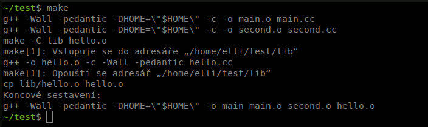

<!--

Linux Kniha kouzel, kapitola GNU make
Copyright (c) 2019 Singularis <singularis@volny.cz>

Toto dílo je dílem svobodné kultury; můžete ho šířit a modifikovat pod
podmínkami licence Creative Commons Attribution-ShareAlike 4.0 International
vydané neziskovou organizací Creative Commons. Text licence je přiložený
k tomuto projektu nebo ho můžete najít na webové adrese:

https://creativecommons.org/licenses/by-sa/4.0/

-->
# GNU make

## Úvod
GNU make je nástroj k automatizaci procesu sestavování určitých cílových souborů ze souborů zdrojových. Vykonává podobnou úlohu jako např. skript napsaný v bashi, ale na rozdíl od něj umí:

* Kompilovat pouze ty části programu, které jsou potřeba (jejichž cílové soubory neexistují nebo se jejich zdrojové soubory změnily).
* Spouštět procesy paralelně, aniž by to narušilo definované závislosti.

Vztahy mezi zdrojovými a cílovými soubory a kompilační příkazy jsou popsány
v tzv. Makefilu (souboru jménem „Makefile“),
jemuž se bude věnovat většina této kapitoly.

## Definice
* **Pravidlo** je definice v Makefilu, která instruuje program make, na kterých dalších souborech určitý soubor závisí a jakými příkazy jej z nich vytvořit či aktualizovat.
* **Cíl** je název souboru k vytvoření či akce k vykonání.
* **Zdroj** (často nazýváný „závislost“) je název souboru, na kterém určitý cíl závisí. Příkazy stanovené pravidlem se vykonají jen tehdy, pokud cíl neexistuje nebo je alespoň jeden jeho z jeho zdrojů novější. (Vychází se z času poslední změny souborů.) Zdrojem může být také název akce.
* **Slovo** je posloupnost nebílých znaků v řetězci. Jednotlivá slova v řetězci jsou od sebe oddělena bílými znaky, nejčastěji jednotlivou mezerou.
* **%-vzor** je řetězec sloužící k filtrování, vyhledávání a nahrazování slov. Jde o velice praktickou věc. Může obsahovat nejvýše jeden znak **%**, který slouží jako náhrada za libovolné množství znaků (včetně lomítek oddělujících adresáře). (Např. %-vzoru **a%** odpovídají právě ta slova, která začínají malým písmenem **a**.) Slouží-li %-vzor k záměně, slova, která mu neodpovídají, projdou záměnou nezměněna. %-vzor nemusí obsahovat znak %; v takovém případě mu odpovídají pouze slova, která se s ním přesně shodují.

## Zaklínadla (v souboru Makefile)
### Nastavení proměnných
*# nastavit proměnnou (expandovat v místě definice)* 
{*NÁZEV\_PROMĚNNÉ*} **:=** {*hodnota včetně mezer*}

*# připojit obsah na konec proměnné (expanze stejně jako v původní definici)* 
{*NÁZEV\_PROMĚNNÉ*} **\+=** {*hodnota včetně mezer*}

*# nastavit proměnnou (expandovat v každém místě použití)* 
{*NÁZEV\_PROMĚNNÉ*} **=** {*hodnota včetně mezer*}

*# přiřadit do proměnné mezeru (trik)* 
**PRAZDNA :=** 
{*NÁZEV\_PROMĚNNÉ*} **:= $(PRAZDNA)&blank;$(PRAZDNA)**

*# nastavit/připojit víceřádkový obsah* 
*// „endef“ musí být na samostatném řádku; operátor může být „=“, „:=“ nebo „+=“.* 
**define** {*NÁZEV\_PROMĚNNÉ*} [{*operátor*}] 
{*víceřádkový obsah*} 
**endef**

### Rozvoj proměnných
*# rozvinout proměnnou* 
**$(**{*NÁZEV\_PROMĚNNÉ*}**)**

*# při rozvinutí proměnné nahradit v každém slově prefix/suffix/obojí* 
*// Třetí uvedená varianta provede náhradu jen ve slovech, kde odpovídá prefix i suffix. Slova, u kterých odpovídá jen prefix nebo jen suffix, projdou bez náhrady.* 
**$(**{*NÁZEV\_PROMĚNNÉ*}**:**[{*původní-prefix*}]**%=**[{*nový-prefix*}]**%)** 
**$(**{*NÁZEV\_PROMĚNNÉ*}**:%**[{*původní-suffix*}]**=%**[{*nový-suffix*}]**)** 
**$(**{*NÁZEV\_PROMĚNNÉ*}**:**[{*původní-prefix*}]**%**[{*původní-suffix*}]**=**[{*nový-prefix*}]**%**[{*nový-suffix*}]**)**

*# rozvinout proměnnou prostředí či příkazového interpretu (ne proměnnou Makefilu)(alternativy)* 
**\$\$**{*NÁZEV\_PROMĚNNÉ*} 
**\$\${**{*NÁZEV\_PROMĚNNÉ*}**}**

*# rozvinout proměnnou, jejíž název je uložený v jiné proměnné* 
**$($(**{*NÁZEV\_PROMĚNNÉ*}**))**

*# příklad záměny při rozvoji − vypíše: bbeceda.cpp hlavicka.h bbakus.cpp ostatni.cc* 
**TEST := abeceda.cc hlavicka.h abakus.cc ostatni.cc** 
**all:** 
<tab>**@echo $(TEST:a%.cc=b%.cpp)**

### Automatické a předdefinované proměnné
*# cíl pravidla (alternativy)* 
**$@** 
**$(@)**

*# první zdroj pravidla (alternativy)* 
**$&lt;** 
**$(&lt;)**

*# všechny zdroje (alternativy)* 
**$\^** 
**$(\^)**

*# mazání souborů (typicky „rm -f“)* 
**$(RM)**

*# program make* 
**$(MAKE)**

*# v generovaném a implicitním pravidle posloupnost znaků odpovídající znaku % v %-vzoru cíle (alternativy)* 
**$\*** 
**$(\*)**

### Obecný tvar pravidel
*# normální (pevné) pravidlo* 
{*cíle oddělené mezerami*}**:** [{*zdroje oddělené mezerami*}] [**;**{*příkaz*}] 
[<tab>[{*prefix-příkazu*}]{*příkaz*}]...

*# zobecněné (generované) pravidlo (zdroje lze odvodit od cíle)* 
{*cíle oddělené mezerami*}**:** {*%-vzor-pro-cíle*}: {*cesta-nebo-%-vzor-zdroje*}... [**;**{*příkaz*}] 
[<tab>[{*prefix-příkazu*}]{*příkaz*}]...

*# obecné (implicitní) pravidlo (zdroje lze odvodit od cíle)* 
*// Obecné pravidlo má nižší prioritu než všechna pevná a generovaná pravidla. Navíc je tiše ignorováno, pokud chybí nekterý ze zdrojů. Má-li uvedeno víc cílů, považují se po jeho provedení všechny uvedené cíle za vygenerované, a tedy se pravidlo nevolá pro překlad dalších zdrojů znovu.* 
{*%-vzor cíle*}...**:** {*cesta-nebo-%-vzor-zdroje*}... [**;**{*příkaz*}] 
[<tab>[{*prefix-příkazu*}]{*příkaz*}]...

*# označit, že určité cíle jsou akce, ne soubory* 
**.PHONY:** [{*akce oddělené mezerami*}]

*# přeložit soubory uvedené v proměnné ZDROJE, které se nacházejí v adresáři „kod“ a jeho podadresářích a mají příponu „.cc“, na objektové soubory do adresáře obj* 
*// Uvedený příklad předpokládá předdefinované proměnné CXX a CXXFLAGS, které GNU make předdefinovává, takže je nemusíte sami nastavovat.* 
**$(patsubst kod/%.cc,obj/%.o,$(filter kod/%.cc,$(ZDROJE))): obj/%.o: kod/%.cc** 
**<tab>$(CXX) $(CXXFLAGS) -c -o $@ $&lt;**

### Textové funkce
*# připojit text před/za každé slovo v řetězci/v rozvoji proměnné* 
*// Při použití poslední uvedené varianty nesmějí text-před a text-za obsahovat znak %.* 
**$(addprefix** {*text-před*},{*řetězec slov*}**)** 
**$(addsuffix** {*text-za*},{*řetězec slov*}**)** 
**$(**{*proměnná*}**:%=**{*text-před*}**%**{*text-za*}**)**

*# provést náhradu (záměnu) ve slovech pomocí %-vzoru* 
**$(patsubst** {*co-nahradit-%-vzor*}**,**{*čím-nahradit-%-vzor*}**,**{*řetězec slov*}**)**

*# vybrat slova odpovídající/neodpovídající kterémukoliv ze zadaných %-vzorů* 
**$(filter** {*%-vzory oddělené mezerou*}...,{*řetězec slov*}**)** 
**$(filter-out** {*%-vzory oddělené mezerou*}...,{*řetězec slov*}**)**

*# nahradit všechny výskyty podřetězce* 
**$(subst** {*co nahradit*}**,**{*čím nahradit*}**,**{*původní text*}**)**

*# normalizovat bílé znaky (posloupnosti nahradit jednou mezerou, na začátku a konci odstranit)* 
**$(strip** {*řetězec*}**)**

*# získat počet slov v řetězci* 
**$(words** {*řetězec*}**)**

*# první/poslední/n-té slovo z řetězce* 
**$(firstword** {*řetězec*}**)** 
**$(lastword** {*řetězec*}**)** 
**$(word** {*n*}**,**{*řetězec*}**)**

*# předposlední/před-předposlední slovo z řetězce* 
**$(if $(word 2,**{*řetězec*}**),$(word $(shell expr $(words** {*řetězec*} **) - 1),**{*řetězec*}**),)** 
**$(if $(word 3,**{*řetězec*}**),$(word $(shell expr $(words** {*řetězec*} **) - 2),**{*řetězec*}**),)**

*# seřadit slova a odstranit duplicity* 
**$(sort** {*řetězec*}**)**

*# obrátit pořadí slov v řetězci* 
**$(shell printf %s\\\\n '$(strip** {*řetězec slov*}**)' \| tr '&blank;' \\\\n \| tac)**

### Analýza adresářových cest (pro každé slovo zvlášť)
*# získat adresářovou cestu (např. „../a/“)* 
*// Neobsahuje-li slovo žádné „/“, vrací pro něj $(dir) „./“.* 
**$(dir** {*řetězec slov*}**)**

*# získat samotný název souboru včetně přípony/bez přípony (např. „b.o“, resp. „b“)* 
**$(notdir** {*řetězec slov*}**)** 
**$(basename $(notdir** {*řetězec slov*}**))**

*# získat příponu souboru (např. „.o“)* 
*// Pozor! Slova, která takovou příponu neobsahují, budou touto funkcí vynechána bez náhrady, což sníží počet slov ve výsledném řetězci.* 
**$(suffix** {*řetězec slov*}**)**

*# získat adresářovou cestu (je-li uvedena) + název souboru bez přípony (např. „../a/b“)* 
**$(basename** {*řetězec slov*}**)**

*# získat úplnou kanonickou cestu existujících souborů a adresářů (např. „/home/elli/test/a/b.o“)* 
**$(realpath** {*řetězec slov*}**)**

*# získat seznam existujících souborů a adresářů odpovídajících vzorku interpretu* 
*// Vzorek příkazového interpretu může obsahovat znaky ? a \* s významem obvyklým v bashi. Pokud vzorku neodpovídá žádný soubor ani adresář, vzorek se potichu přeskočí. Toho je možno použít k vynechání neexistujících souborů z proměnné.* 
**$(wildcard** {*vzorek*}...**)**

### Logické funkce

*# podmíněný výraz* 
**$(if** {*podmínkový řetězec*}**,**{*je-li neprázdný*}[**,**{*jinak*}]**)**

*# získat první neprázdný řetězec* 
**$(or** {*řetězec*}[**,**{*další řetězec*}]...**)**

*# získat první prázdný řetězec, nebo jsou-li všechny neprázdné, poslední z nich* 
**$(and** {*řetězec*}[**,**{*další řetězec*}]...**)**

*# pro každé slovo ze seznamu toto slovo nastavit do proměnné a rozvinout podvýraz* 
**$(foreach** {*proměnná*}**,**{*seznam*}**,**{*podvýraz*}**)**

*# vrátí podřetězec, pokud se vyskytuje v řetězci; jinak vrátí prázdný řetězec* 
**$(findstring** {*podřetězec*}**,**{*řetězec*}**)**

*# příklad − vrátí: aa bb cc cc bb aa* 
**$(foreach PROM,a b c c b a,$(PROM)$(PROM))**

### Příkazy v pravidlech
*# vykonat příkaz bez vypsání* 
<tab>**@**{*příkaz*}

*# vykonat příkaz a ignorovat návratovou hodnotu* 
<tab>**\-**{*příkaz*}

### Podmíněný překlad a include

*# podmíněný překlad* 
*// Vybere první z alternativ, kde jsou si uvedené výrazy po rozvinutí rovny. Doporučuji alternativy v Makefilu odsadit, ale není to vyžadováno.* 
**ifeq "**{*výraz 1*}**" "**{*výraz 2*}**"** 
{*první alternativa*} 
[**else ifeq "**{*výraz 1*}**" "**{*výraz 2*}**"** 
{*další alternativa*}]... 
[**else** 
{*poslední alternativa*}] 
**endif**

*# načíst kód Makefilu z jiných souborů, jako by byl zde* 
**include** {*soubory*}...

### Ostatní funkce

*# vykonat příkaz v aktuálním shellu (typicky bash) a rozvinout se na jeho výstup; konce řádků se nahradí mezerami* 
**$(shell** {*příkaz shellu*}**)**

*# vyvolat chybu a ukončit zpracování Makefile* 
*// Tip: Popis chyby v parametru funkce $(error) může obsahovat rozvoj proměnných a volání funkcí.* 
**$(error** {*popis chyby*}**)**

*# vypsat varování/zprávu* 
*// Výsledkem expanze funkcí $(warning) a $(info) je prázdný řetězec.* 
**$(warning** {*popis varování*}**)** 
**$(info** {*zpráva*}**)**

## Parametry příkazů
*# make* 
**make** [{*parametry*}] [{*cíl*}]... 
**$(MAKE)** [{*parametry*}] [{*cíl*}]...

* **\-j** {*počet*} \:\: umožní paralelní běh více úloh najednou
* **\-C** {*adresář*} \:\: před děláním čehokoliv (dokonce i hledání Makefilu) vstoupí do zadaného adresáře
* **\-n** \:\: nespouští příkazy, pouze je vypíše
* **\-s** \:\: nevypisuje příkazy, pouze je spouští
* Není-li cíl zadán, použije se první cíl v Makefile (tradičně akce „all“).

## Instalace na Ubuntu
*# * 
**sudo apt-get install make**

## Ukázka
*# /home/elli/test/Makefile:* 
**\# Komentář** 
**SHELL := /bin/sh** 
**CXX := g++** 
**CXXFLAGS := -Wall \\** 
**&nbsp;&nbsp;-pedantic -DHOME=\\"\$\$HOME\\"** 
**OBJS := main.o second.o** 
**OBJS += hello.o** 
**SOURCES := $(OBJS:%.o=%.cc)** 
**.PHONY: all clean** 
 
**all: main** 
**clean:** 
**<tab>$(MAKE) -C lib clean** 
**<tab>$(RM) $(OBJS)** 
**main: $(OBJS)** 
**<tab>@echo "Koncové sestavení:"** 
**<tab>$(CXX) $(CXXFLAGS) -o $@ $\^** 
**main.o second.o: %.o: %.cc lib/hello.h** 
**<tab>$(CXX) $(CXXFLAGS) -c -o $@ $&lt;** 
**hello.o:** 
**<tab>$(MAKE) -C lib hello.o** 
**<tab>cp lib/hello.o $@**

*# /home/elli/test/lib/Makefile:* 
**.PHONY: clean** 
**hello.o: hello.cc hello.h** 
**<tab>g++ -o $@ -c -Wall -pedantic hello.cc** 
**clean:** 
**<tab>$(RM) hello.o**

## Tipy a zkušenosti
* Dlouhé řádky Makefilu můžete rozdělit, pokud před každý konec řádku, který má make ignorovat, vložíte zpětné lomítko. Rozdělíte-li řádek s příkazem, make toto rozdělení předá volanému interpretu příkazové řádky, což však u běžně používaných „sh“ a „bash“ nezpůsobí problémy.
* Nebojte se definovat více cílů v jednom pravidle. Funguje to stejně jako definovat stejné pravidlo pro každý uvedený cíl zvlášť a ušetří vám to spoustu práce s údržbou. Ze stejného důvodu se vyplatí naučit se syntaxi pravidla s %-vzorem.
* Pro jeden cíl můžete definovat více pravidel, pokud nejvýše jedno z nich bude deklarovat příkazy; v takovém případě se automaticky sloučí zdroje ze všech odpovídajících pravidel.
* Program make v příkazech pravidel interpretuje znak $. Má-li se předat shellu, je třeba jej zdvojit, např. **\$\$PATH** nebo **\$\$\$\$**. To platí i při uzavření do apostrofů.
* Některé textové editory mohou v závislosti na svém nastavení nahrazovat tabulátory mezerami či naopak. Pokud takovým editorem upravíte Makefile, přestane fungovat, protože na začátku každého příkazu v pravidle musí být tabulátor, ne posloupnost mezer.
* Obvyklé názvy akcí jsou např.: all, clean, install.
* Každý příkaz pravidla se při kompilaci spouští ve vlastní instanci interpretu příkazové řádky!
* Použitý interpret v příkazech a volání funkce $(shell) určuje proměnná **SHELL**. Kvůli přenositelnosti se doporučuje ji na začátku Makefile výslovně nastavit: **SHELL := /bin/sh** nebo **SHELL := /bin/bash**.
* Akce může mít jako zdroje soubory a další akce; ty budou přeloženy před vykonáním vlastní akce.

## Jak získat nápovědu
* **make \-\-help**
* Online GNU manuál (viz sekce Odkazy) (anglicky)
* **man make** (anglicky)

## Odkazy
### Česky
* [Makefile na sallyx.org](https://www.sallyx.org/sally/c/linux/makefile)
* [Stránka na Wikipedii](https://cs.wikipedia.org/wiki/Make)
* [Rychlo-školička pro Makefile](http://www.linux.cz/noviny/1999-0304/clanek12.html)
* [Správa projektů pomocí programu Make](http://www.fit.vutbr.cz/~martinek/clang/make.html)

### Anglicky
* [Oficiální manuál GNU make](https://www.gnu.org/software/make/manual/make.html) (anglicky)
* [Manuálová stránka](http://manpages.ubuntu.com/manpages/bionic/en/man1/make.1.html) (anglicky)
* [Balíček Ubuntu Bionic Beaver](https://packages.ubuntu.com/bionic/make) (anglicky)
* [Oficiální stránka GNU make](https://www.gnu.org/software/make/) (anglicky)

## Snímek obrazovky

